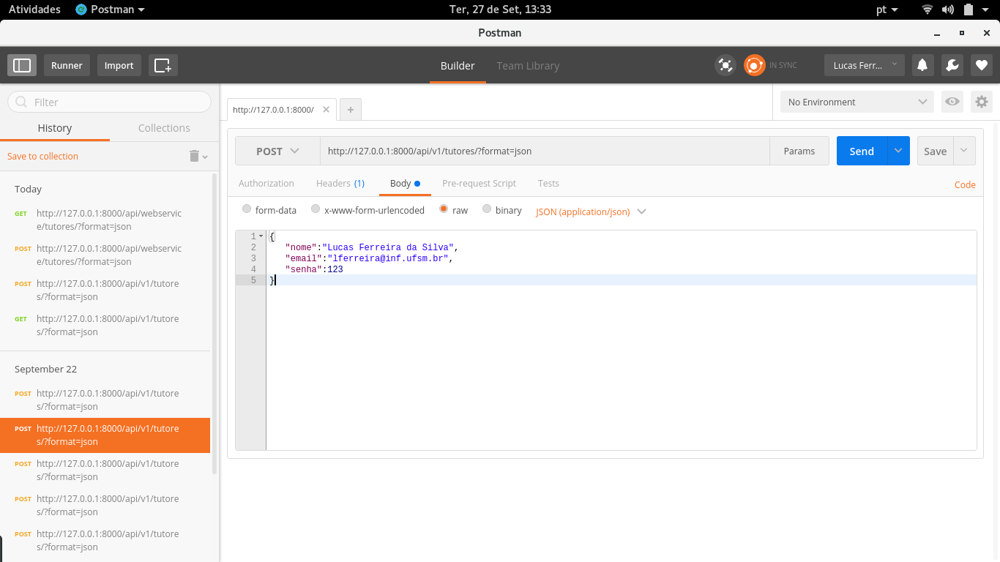

# ProgressCode - Projeto de Software II
A partir do estudo de caso do Clube de Computação da UFSM, constatou-se a necessidade de uma ferramenta que pudesse auxiliar os tutores no processo de acompanhamento dos alunos, bem como algo que centralizasse a grande quantidade de informações relacionadas as atividades e seus respectivos participantes. Sendo assim, o presente projeto visa o desenvolvimento de um sistema que atenda a esses dois requisitos de forma integrada.

O sistema proposto basicamente fará uso de duas tecnologias de forma conjunta, a primeira delas refere-se a um aplicativo mobile com o objetivo de auxiliar os tutores na supervisão dos alunos e a segunda trata-se de um pequeno sistema web em que se concentrarão as informações coletadas pelos tutores por meio do app.

A partir da aplicação mobile, cada tutor poderá registrar o progresso de cada aluno de uma forma rápida e simplificada. O aplicativo também possibilitará o apontamento de observações audíveis de cada participante por meio da gravação de áudio para agilizar a tarefa de registro e, ainda, poderá se ter uma visão simplificada do progresso de cada um dos alunos e da turma com um todo.

Já o sistema web, será responsável por agrupar as informações provenientes da observação de cada tutor em seu app. Esse sistema contará com as funções de criação de turma, criação de atividade, visualização do progresso de cada aluno, visualização do progresso da turma e criação de uma lista de chamada.


## Pacotes, libs e frameworks necessários

**Cliente MySQL**
```
sudo apt-get install libmysqlclient-dev
```

**Cliente MySQL para Python 3**
```
sudo pip3 install mysqlclient
```

**Django Framework (versão 10.1)**
```
pip3 install Django
```

**Django Tastypie RESTful API**
```
pip3 install django-tastypie==0.13.3

pip3 install defusedxml

pip3 install lxml
```

## Criando o banco de dados para a conexão com o Django

**Criar database nomeada como: "progress_code"**
```
CREATE DATABASE progress_code;
```

**Criar usuário "pcode" com privilégios de root e password "root"**
```
CREATE USER 'pcode'@'localhost' IDENTIFIED BY 'root';
GRANT ALL PRIVILEGES ON *.* TO 'pcode'@'localhost' WITH GRANT OPTION;
```

**Configuração do arquivo "settings.py" do projeto Django**
```
DATABASES = {
    'default': {
        'ENGINE': 'django.db.backends.mysql',
        'NAME': 'progress_code',
        'USER': 'pcode',
        'PASSWORD': 'root',
        'HOST': 'localhost',
        'PORT': '3306',
    }
}
```
## Acessar WebService RESTful

**No webservice só estão liberadas as funções de GET e POST, as demais funções também funcionam mas não estão ativadas no codigo. Abaixo exemplos de GET e POST**


OBS.: para relização do POST dos exemplos utilizou-se o plugin do Chrome "Postman", disponível em: [Postman](https://chrome.google.com/webstore/detail/postman/fhbjgbiflinjbdggehcddcbncdddomop)

### GET

**Para interagir com o webservice basta utilizar a url da query que se deseja fazer, exemplo:**
```
http://127.0.0.1:8000/api/webservice/model_do_banco/?format=json
```

**Exemplo de consulta de todos tutores cadastrados:**
```
http://127.0.0.1:8000/api/webservice/tutores/?format=json
```

**Exemplo de consulta do tutor de id "1":**
```
http://127.0.0.1:8000/api/webservice/tutores/1/?format=json
```

**Exemplo de consulta de tutores cujo email contém "lferreira":**
```
http://127.0.0.1:8000/api/webservice/tutores/?format=json&email__contains=lferreira
```

### POST

**Exemplo (imagem) de cadastro de tutor via método POST usando o plugin "Postman"**

- Marcar opção post no lado esquerdo do campo onde é fornecia a URL;
- Logo abaixo do campo da URL marcar a opção "Body";
- Com a opção "Body" já marcada selecionar o formato de entrada "raw";
- Informar os dados do POST no formato JSON;
- Send.




## Cronograma de atividades

| Data Limite | Atividade a ser desenvolvida | Status |
| --------|---------|-------|
| 16/09 | Criação do banco de dados | x |
| 23/09 | Criação do CRUD do banco de dados | x | 
| 23/09 | Criação do Web Service RESTful | x |
| 30/09 | Criação de funções de request do app mobile | X |
| 30/09 | Criação de funções de response do app mobile | X |
| 05/10 | Criação de funções de request do sistema web | X |
| 05/10 | Criação de funções de response do sistema web | X |
| 10/10 | Criação de funções de autenticação no app mobile e no sistema web | X |
| 10/10 | Criação das Activities basicas no app mobile | X |
| 14/10 | Criação dos Models, Views e Templates basicos no sistema web | X |
| 18/10 | Criação de funções de cadastro de evento e encontros no app mobile | X |
| 18/10 | Criação de funções de cadastro de evento e encontros no sistema web | X |
| 23/10 | Criação de funções de cadastro de tutores e equipes no app mobile | X |
| 23/10 | Criação de funções de cadastro de tutores e equipes no sistema web | X |
| 25/10 | Criação das funções de feedback de alunos | X |
| 05/11 | Criação das funções de manipulação e envio do áudio capturado com o dispositivo | X |
| 05/11 | Criação de funções de importação do .csv da listagem de participantes de cada evento | X |
| 10/11 | Melhoramento de UX e design da interface mobile | X |
| 12/11 | Melhoramento das páginas para visualização dos dados coletados com o app | X |
| 16/11 | Melhoramento de UX e design da interface web | X |
| 23/11 | Criação da função de chamada de alunos | X |
| 30/11 | Testes| X |

